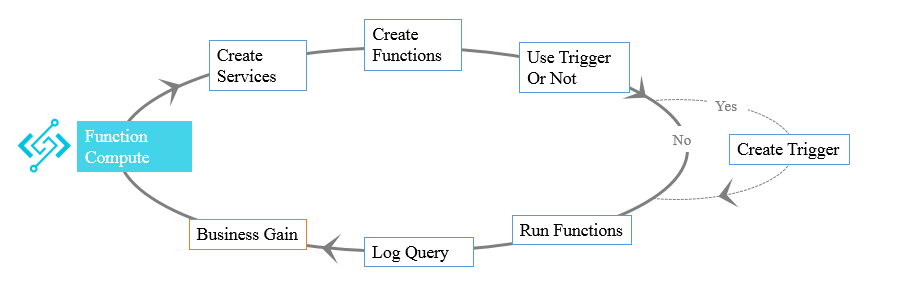
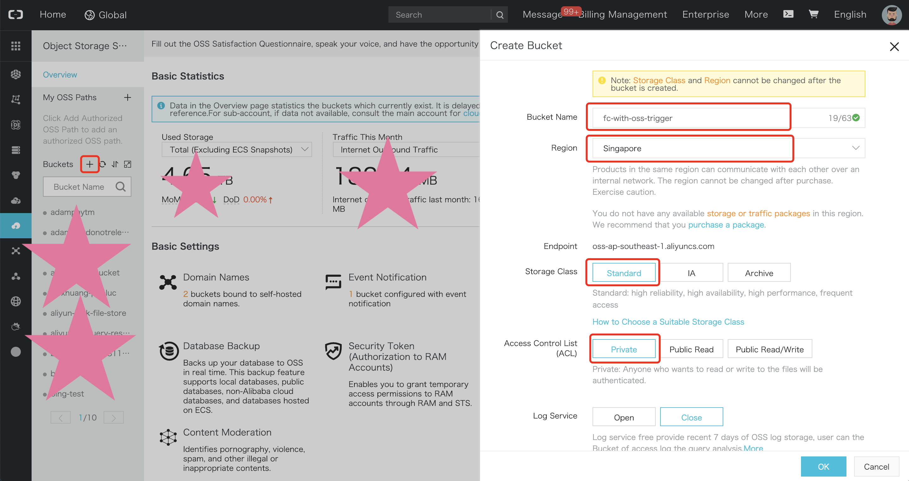
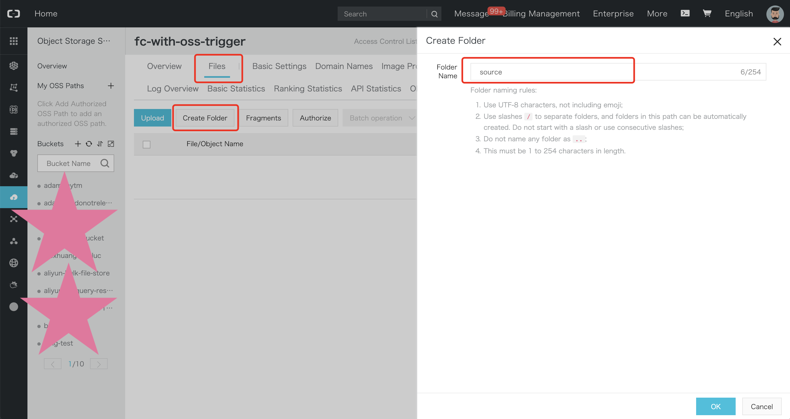
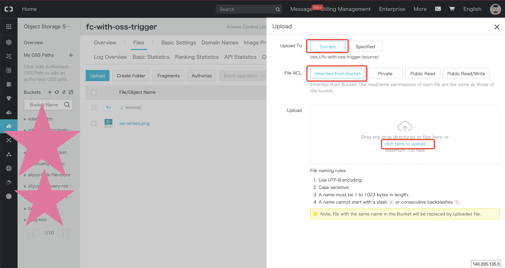
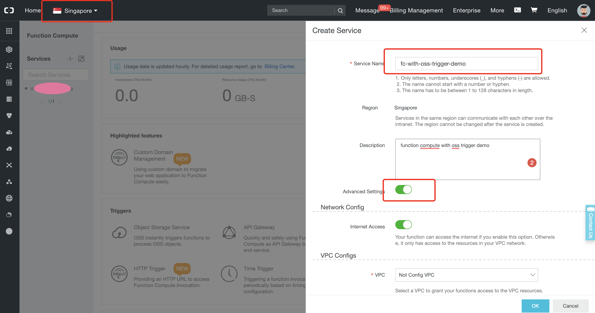
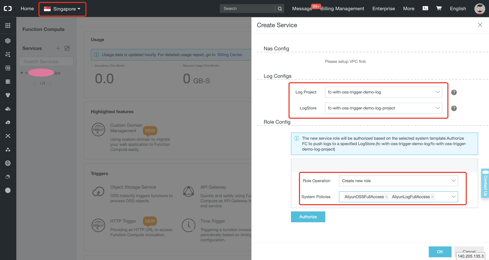
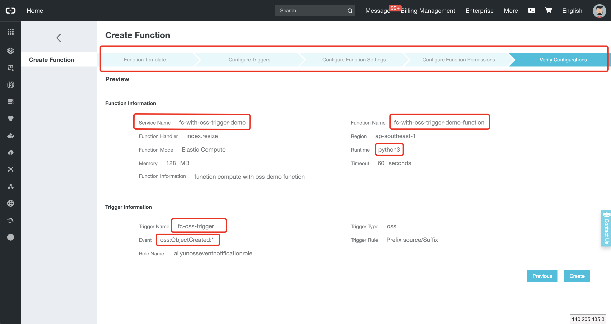
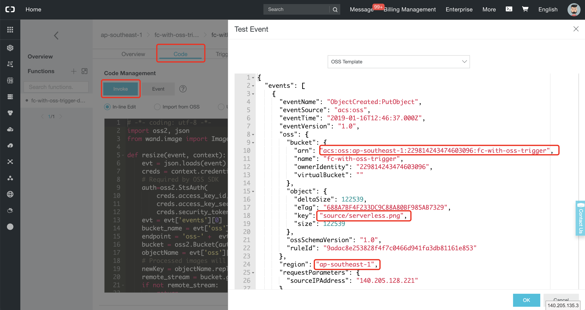
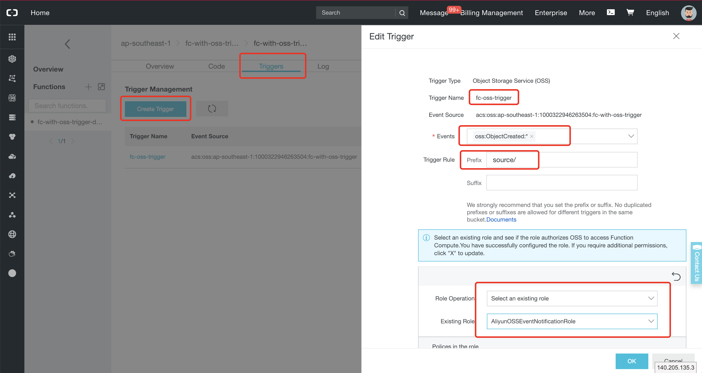
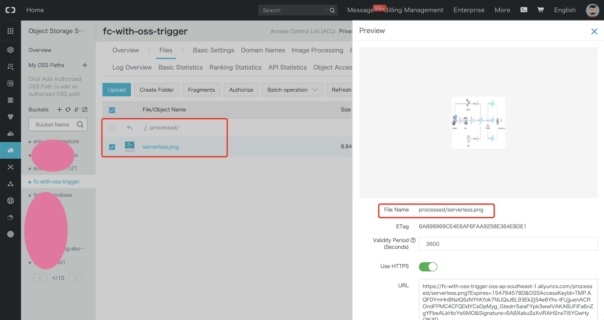

# Function compute with OSS trigger

Welcome to this tutorial! In this document you will learn about how to use
[Alibaba Cloud Function Compute](https://www.alibabacloud.com/product/function-compute) with 
[OSS](https://www.alibabacloud.com/product/oss) via [OSS triggers](https://www.alibabacloud.com/help/doc-detail/62922.htm).

## Summary

1. [Introduction](#introduction)
2. [Prerequisite](#prerequisite)
3. [Function Compute architecture and overall procedure](#function-compute-architecture-and-overall-procedure)
    1. [Abstract](#abstract)
    2. [Architecture and procedure](#architecture-and-procedure)
    3. [OSS events](#oss-events)
    4. [OSS event format](#oss-event-format)
4. [Steps](#steps)
    1. [Create an OSS bucket](#create-an-oss-bucket)
    2. [Create a log project](#create-a-log-project)
    3. [Create a function](#create-a-function)
    4. [Test the function](#test-the-function)
    5. [Create an OSS trigger](#create-an-oss-trigger)
    6. [Test the trigger](#test-the-trigger)
5. [Further reading](#further-reading)

## Introduction

Alibaba Cloud Function Compute is an event-driven and fully-managed compute service. With Function Compute, you can
quickly build any type of applications or services without considering management or Operations and Maintenance (O&M).
For example you can complete a set of backend services for processing multimedia data in just few days.

Function Compute integrates different services in an event-driven manner. When the event source service triggers an
event, the associated function is automatically called to process the event.

You can trigger function invocations via events from [OSS](https://www.alibabacloud.com/product/oss),
[Log Service](https://www.alibabacloud.com/product/log-service),
[API Gateway](https://www.alibabacloud.com/product/api-gateway) or
[Table Store](https://www.alibabacloud.com/product/table-store); or invoke functions directly
via [the Function Compute SDK and REST API](https://www.alibabacloud.com/help/doc-detail/52878.htm). With these
services and features, you can easily build elastic, reliable, and secure applications. For more information
about the type of event sources supported by Function Compute, please read
[this document](https://www.alibabacloud.com/help/doc-detail/74707.htm).

## Prerequisite
Please [create an Alibaba Cloud account](https://www.alibabacloud.com/help/doc-detail/50482.htm) and
[obtain an access key id and secret](https://www.alibabacloud.com/help/faq-detail/63482.htm).

You should also visit the [Function Compute console](https://fc.console.aliyun.com) and the
[OSS one](https://oss.console.aliyun.com) at least once, in order to activate these services.

## Function Compute architecture and overall procedure

### Abstract
Alibaba Cloud Object Storage Service (OSS) allows you to securely store massive amounts of data in the cloud at low
costs. With HTTP RESTful APIs, you can easily store and access data on the Internet.

Function Compute integrates seamlessly with OSS. You can configure functions for different types of events so that
OSS can automatically call a function after a certain event is happening.

### Architecture and procedure
To build a service in Function Compute, we need to follow these steps:



1. Create a service.
2. Create a function that encodes the business logic.
3. Trigger function execution via an event.
4. View function execution logs.
5. Monitor the service and create alarms.

### OSS events
After an event is detected, OSS encodes the event information into a JSON string and passes it to an event processing
function. The following table contains some example events that are supported by OSS. The full list
[is available here](https://www.alibabacloud.com/help/doc-detail/62922.htm#h2-oss-events1).

| Event        | Description           | Remarks  |
| ------------- | ------------- | ----- |
| oss:ObjectCreated:PutObject      | A function is triggered after the OSS PutObject API operation creates an object. | PutObject is used to upload files. For more information, see [PutObject](https://www.alibabacloud.com/help/doc-detail/31978.htm). |
| oss:ObjectCreated:* | A function is triggered after any of the preceding ObjectCreated API operations is executed. | A function is triggered after any of the preceding ObjectCreated API operations is executed. |
| oss:ObjectRemoved:DeleteObject | A function is triggered after the OSS DeleteObject API operation deletes an object. | DeleteObject is used to delete a certain object. For more information, see [DeleteObject](https://www.alibabacloud.com/help/doc-detail/31982.htm). |

### OSS event format
When OSS triggers a function, the event context is passed as a parameter. 
Here is a sample event context you can get when a user uploads an object to OSS:
```json
{
  "events": [
    {
      "eventName": "ObjectCreated:PutObject",
      "eventSource": "acs:oss",
      "eventTime": "2019-01-16T12:46:37.000Z",
      "eventVersion": "1.0",
      "oss": {
        "bucket": {
          "arn": "acs:oss:ap-southeast-1:229814243474603096:fc-with-oss-trigger",
          "name": "fc-with-oss-trigger",
          "ownerIdentity": "229814243474603096",
          "virtualBucket": ""
        },
        "object": {
          "deltaSize": 122539,
          "eTag": "688A7BF4F233DC9C88A80BF985AB7329",
          "key": "source/serverless.png",
          "size": 122539
        },
        "ossSchemaVersion": "1.0",
        "ruleId": "9adac8e253828f4f7c0466d941fa3db81161e853"
      },
      "region": "ap-southeast-1",
      "requestParameters": {
        "sourceIPAddress": "140.205.128.221"
      },
      "responseElements": {
        "requestId": "58F9FF2D3DF792092E12044C"
      },
      "userIdentity": {
        "principalId": "229814243474603096"
      }
    }
  ]
}
```

## Steps
In this tutorial, we will develop a simple demo that automatically resize images when they are uploaded on
an [OSS bucket](https://www.alibabacloud.com/help/doc-detail/31827.htm#h2-url-1). The images will need to be
uploaded into a `source/` folder, the function will process it and save it into a `processed/` folder (for example
the image `source/serverless.png` will be processed into `processed/serverless.png`).

### Create an OSS bucket
1. Go to the [OSS console](https://oss.console.aliyun.com/).
2. [Create a bucket](https://www.alibabacloud.com/help/doc-detail/31885.htm):

    Select the "Singapore" region, set the OSS bucket name to "fc-with-oss-trigger", set
    the storage class to "Standard Storage" and set ACL to "Private".

    >__Note__: The storage class and region cannot be changed once a bucket is created.

    

3. Click on the bucket you have created. On the displayed page, click on the "Files" tab, then "Create Folder",
    and set the folder name to `source`. Finally, click on "OK".

    

4. In the `/source` directory, upload an image. In this example, the [serverless.png](images/serverless.png) image is uploaded.

    

### Create a log project
1. Go to the [Log Service console](https://sls.console.aliyun.com/).
2. Click on the "Create Project" button:

    Set the project name to "fc-with-oss-trigger-demo-log-project" and select the "Singapore" region.

3. A popup should ask you to create a logstore, click on the "Create" button:

    Set the Logstore name to "fc-with-oss-trigger-demo-log-store", leave all the other parameters to their default
    values and click on the "Confirm" button.

4. A new popup should invite you to open the "Data Import Wizard", just click on the "Cancel" button.

### Create a function
>__Note__: your function and the OSS bucket must be in the same region.

1. Go to the [Function Compute console](https://fc.console.aliyun.com/).
2. [Create a service](https://www.alibabacloud.com/help/doc-detail/73337.htm):
  
    Select the "Singapore" region, set the service name to "fc-with-oss-trigger-demo", enable advanced settings,
    select the log project "fc-with-oss-trigger-demo-log-project", select the log store
    "fc-with-oss-trigger-demo-log-store", select the role operation "Create new role", add the system policies
    `AliyunOSSFullAccess` and `AliyunLogFullAccess`, then click on the "Authorize" button.

    

    

3. A new tab should open with the title "Role Templates". Click on the "Confirm Authorization Policy" button.

4. Back to the previous tab, click on "OK" to create the service.

5. [Create a function](https://www.alibabacloud.com/help/doc-detail/73338.htm):
        
    Select the "Empty Function" template, select no trigger type, set the function name to
    "resize", set the runtime environment to "python2.7", leave other parameters to their default values, click on
    the "Next" buttons two times and click on "Create".

    

6. Replace the function code with the following content and click on "Save":

```python
# -*- coding: utf-8 -*-
import oss2, json
from wand.image import Image

def handler(event, context):
    evt = json.loads(event)
    creds = context.credentials
    # Required by OSS SDK
    auth=oss2.StsAuth(
        creds.access_key_id,
        creds.access_key_secret,
        creds.security_token)
    evt = evt['events'][0]
    bucket_name = evt['oss']['bucket']['name']
    endpoint = 'oss-' +  evt['region'] + '.aliyuncs.com'
    bucket = oss2.Bucket(auth, endpoint, bucket_name)
    objectName = evt['oss']['object']['key']
    # Processed images will be saved to processed/
    newKey = objectName.replace("source/", "processed/")
    remote_stream = bucket.get_object(objectName)
    if not remote_stream:
        return
    remote_stream = remote_stream.read()
    with Image(blob=remote_stream)  as img:
        with img.clone() as i:
            i.resize(128, 128)
            new_blob = i.make_blob()
            bucket.put_object(newKey, new_blob)
```

### Test the function
Before creating a trigger, you can simulate the execution process by triggering an event. In this step, we simulate
the execution process of Function Compute when an object is uploaded into the `source/` directory in the OSS bucket.
You can use this method for debugging and testing.

To test the function in the Function Compute console, follow these steps:
1. Connect to the [Function Compute console](https://fc.console.aliyun.com/) then select your service and function.
2. Open the code tab and click on the "Event" button.
3. Write the following event and click on "OK":

    ```json
    {
      "events": [
        {
          "eventName": "ObjectCreated:PutObject",
          "eventSource": "acs:oss",
          "eventTime": "2017-04-21T12:46:37.000Z",
          "eventVersion": "1.0",
          "oss": {
            "bucket": {
              "arn": "acs:oss:ap-southeast-1:1237050315505689:fc-with-oss-trigger",
              "name": "fc-with-oss-trigger",
              "ownerIdentity": "1237050315505689",
              "virtualBucket": ""
            },
            "object": {
              "deltaSize": 122539,
              "eTag": "688A7BF4F233DC9C88A80BF985AB7329",
              "key": "source/serverless.png",
              "size": 122539
            },
            "ossSchemaVersion": "1.0",
            "ruleId": "9adac8e253828f4f7c0466d941fa3db81161e853"
          },
          "region": "ap-southeast-1",
          "requestParameters": {
            "sourceIPAddress": "140.205.128.221"
          },
          "responseElements": {
            "requestId": "58F9FF2D3DF792092E12044C"
          },
          "userIdentity": {
            "principalId": "262561392693583141"
          }
        }
      ]
    }
    ```

    > __Note__: don't forget to adapt the bucket name twice if you have chosen a different name than in this demo.
    
    

4. Click on "Invoke".
5. After the function is executed successfully, you can find the `processed` directory in the OSS bucket.
    This directory should contain the "serverless.png" image.

### Create an OSS trigger
1. Log on to the [Function Compute console](https://fc.console.aliyun.com/).
2. Click __Triggers__ on the code execution page.
3. Set the trigger type as __Object Storage Service (OSS)__, and select the new bucket.
4. Select `oss:objectCreated:*` as the trigger event, and __source/__ as the prefix.

    This configuration indicates that the function is triggered immediately when a new object is created with a
    source/ prefix in the bucket.
5. In Invocation Role Management, select __Select an existing role__. The system provides a role named
`AliyunOSSEventNotificationRole` for the OSS trigger, and you can select this role directly as the trigger role.
    
    The trigger needs to set a trigger role to authorize the execution of the function. OSS needs to play this
    role to trigger the function. For more information on permissions, see 
    [User permissions](https://www.alibabacloud.com/help/doc-detail/52885.htm).



### Test the trigger
After the OSS trigger is set, you can test the entire project. You can upload a new image to the corresponding
`source/` directory in the Bucket in OSS console, and you find a new resized image of the same name in the
`processed/` directory.



## Further reading
* [Help documents](https://www.alibabacloud.com/help/doc-detail/52895.htm)
* [OSS API Documents](https://www.alibabacloud.com/help/doc-detail/31947.htm)